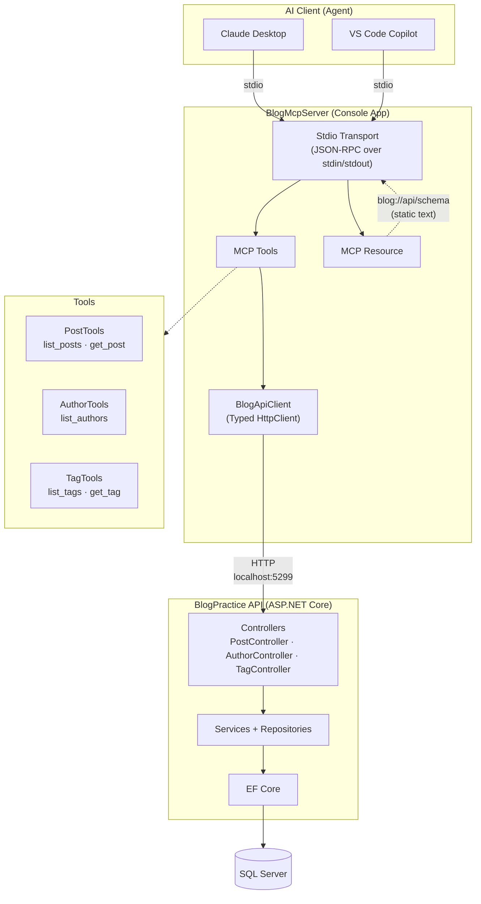

```mermaid
flowchart TB
    subgraph AI_Client["AI Client (Agent)"]
        Claude["Claude Desktop"]
        Copilot["VS Code Copilot"]
    end

    subgraph MCP_Server["BlogMcpServer (Console App)"]
        direction TB
        Transport["Stdio Transport\n(JSON-RPC over stdin/stdout)"]
        Tools["MCP Tools"]
        Resource["MCP Resource"]
        Client["BlogApiClient\n(Typed HttpClient)"]

        Transport --> Tools
        Transport --> Resource
        Tools --> Client
    end

    subgraph Tools_Detail["Tools"]
        PT["PostTools\nlist_posts · get_post"]
        AT["AuthorTools\nlist_authors"]
        TT["TagTools\nlist_tags · get_tag"]
    end

    subgraph API["BlogPractice API (ASP.NET Core)"]
        Controllers["Controllers\nPostController · AuthorController · TagController"]
        Services["Services + Repositories"]
        EF["EF Core"]
    end

    DB[("SQL Server")]

    Claude -- "stdio" --> Transport
    Copilot -- "stdio" --> Transport
    Tools -.-> Tools_Detail
    Client -- "HTTP\nlocalhost:5299" --> Controllers
    Controllers --> Services --> EF --> DB
    Resource -. "blog://api/schema\n(static text)" .-> Transport
```